# Self-Healing LLM Gateway

A local-first, reliability-engineered API gateway and proxy built in front of Large Language Model (LLM) providers. Built with **Python 3.12**, **FastAPI**, **LiteLLM**, **Redis**, **PostgreSQL**, **Prometheus**, and **Grafana**, the gateway delivers an OpenAI-compatible API featuring automated error classification, exponential backoff with uniform jitter, distributed three-state circuit breakers, automatic cross-provider failover, HALF_OPEN recovery probing, sliding-window log rate limiting, token/cost accounting, and real-time observability.

---

## 1. Overview & Problem Statement

Calling Large Language Model APIs directly from application code introduces critical reliability and operational vulnerabilities:
- **Upstream Outages & Network Flakiness**: Transient TCP timeouts, rate limits (HTTP 429), socket drops, or upstream 5xx errors cause unhandled exceptions and degraded user experience.
- **Cascading Latency**: Naive retry loops hit dead providers repeatedly, consuming thread budgets and compounding upstream outages.
- **Provider Vendor Coupling**: Client applications tightly coupled to specific SDKs lack dynamic, zero-code failover to alternative providers during outages.
- **Uninstrumented Costs & Usage**: Distributed teams lack centralized accounting for token consumption, latency percentiles (p50/p95/p99), error breakdowns, and circuit breaker trip events.

**The Self-Healing LLM Gateway** sits between application clients and downstream LLM inference backends, wrapping every request in multi-layer protection, automated resilience workflows, and unified observability.

---

## 2. Key Features

- **OpenAI-Compatible Chat API**: Drop-in endpoint `POST /v1/chat/completions` supporting standard request structures (`model`, `messages`, `temperature`, `max_tokens`, `metadata`).
- **API-Key Authentication & Multi-Tenancy**: SHA-256 hashed API key authentication with in-memory TTL caching and strict tenant-scoped context propagation (`TenantContext`).
- **Redis Sliding-Window Rate Limiting**: Distributed, atomic sliding-window log rate limiter enforcing Requests-Per-Minute (RPM) per tenant with standard response headers (`Retry-After`, `X-RateLimit-*`).
- **Normalized Error Classification**: Maps upstream exceptions (`Timeout`, `APIConnectionError`, `RateLimitError`, `InternalServerError`, `BadRequestError`, etc.) into structured categories with deterministic retryability and failover semantics.
- **Bounded Retries with Uniform Jitter**: Exponential backoff with uniform random jitter scaling ($[0.5, 1.5]$), bounded by `MAX_RETRIES` on the active target provider before initiating cross-provider failover.
- **Distributed Three-State Circuit Breakers**: `CLOSED` $\leftrightarrow$ `OPEN` $\leftrightarrow$ `HALF_OPEN` state machine backed by Redis (with automatic in-memory fallback) to fast-fail dead providers and eliminate upstream timeout latency.
- **Automatic Cross-Target Failover**: Transparently shifts traffic to prioritized candidate providers (`priority=1` $\to$ `priority=2`) when retries exhaust or circuits open.
- **Self-Healing Recovery Probing**: After a configurable cooldown (`CIRCUIT_COOLDOWN_SECONDS`), permits a single probe request via concurrency lock in `HALF_OPEN` state, resetting to `CLOSED` upon verified success.
- **Durable Audit & Usage Accounting**: Asynchronously records request metadata, latency, token consumption (input/output/total), and calculated USD costs in PostgreSQL.
- **Full Observability & Metrics**: Prometheus metric instrumentation scraped every 10s and visualized through pre-provisioned Grafana dashboards.
- **Multi-Container Fault Isolation Architecture**: Local Docker Compose deployment featuring independent Ollama inference containers (`ollama-primary` and `ollama-secondary`) on an isolated bridge network to demonstrate container and TCP connection-level fault isolation and failover.

---

## 3. Architecture

### Request Flow & Reliability Topology

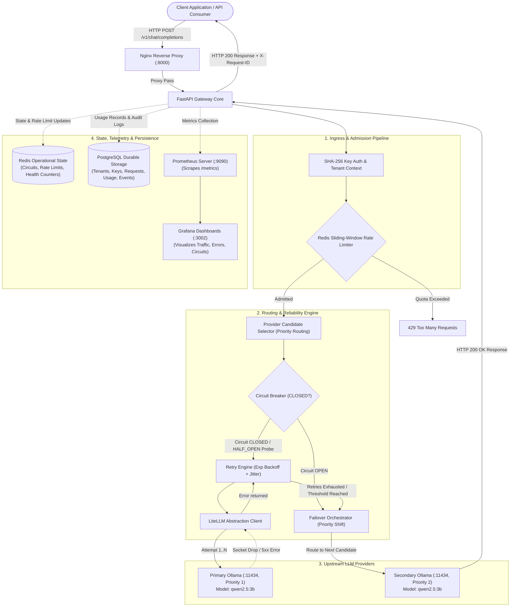

### Containerized Service Composition

| Service | Container Name | Host Port | Internal Port | Role & Functionality |
| :--- | :--- | :--- | :--- | :--- |
| **`nginx`** | `llm-gateway-nginx` | `8000` | `80` | Public ingress reverse proxy; routes traffic and shields internal `/metrics` |
| **`gateway`** | `llm-gateway-api` | *Internal* | `8000` | FastAPI core executing routing, circuit breaking, retry, failover, and metrics |
| **`redis`** | `llm-gateway-redis` | *Internal* | `6379` | Operational state: distributed circuit breaker state, sliding-window rate limit logs |
| **`postgres`** | `llm-gateway-postgres` | *Internal* | `5432` | Durable relational storage: tenant entities, hashed keys, audit ledgers, usage logs |
| **`ollama`** | `llm-gateway-ollama` | *Internal* | `11434` | Local inference engine serving configured default model (`qwen2.5:3b`) |
| **`prometheus`** | `llm-gateway-prometheus` | `9090` | `9090` | Time-series metrics engine scraping gateway metrics every 10s |
| **`grafana`** | `llm-gateway-grafana` | `3002` | `3000` | Pre-provisioned dashboards for live latency, throughput, failovers, and circuits |

*(In physical failover demonstration mode, the Compose overlay adds independent `ollama-primary` and `ollama-secondary` inference containers and configures the gateway's provider targets to use them for the failover demonstration).*

---

## 4. Request Lifecycle

Every chat completion request passes through the following logical reliability pipeline:

```text
Client Application (POST /v1/chat/completions)
  │
  ├─► 1. Ingress: Request arrives at Nginx reverse proxy on host port 8000 and is forwarded to FastAPI.
  ├─► 2. Correlation ID: X-Request-ID header is extracted or generated (UUIDv4) and attached to ContextVar scope.
  ├─► 3. Authentication: Gateway extracts Bearer token, hashes it via SHA-256, and resolves TenantContext in PostgreSQL / memory cache.
  ├─► 4. Rate Limiting: Redis sliding-window log checks if tenant requests exceed DEFAULT_TENANT_RPM (60 RPM). Returns HTTP 429 if exceeded.
  ├─► 5. Candidate Routing: Router queries available ProviderTargets matching the requested model, sorted by priority (1=highest).
  ├─► 6. Circuit State Check: CircuitBreakerManager verifies active target circuit state in Redis. If OPEN, candidate is bypassed immediately.
  ├─► 7. Provider Attempt: RetryManager dispatches request to LiteLLMService against target API endpoint with PROVIDER_TIMEOUT (30s).
  ├─► 8. Error Classification: If an exception occurs, ErrorClassifier categorizes it (TIMEOUT, CONNECTION_ERROR, SERVER_ERROR, etc.).
  ├─► 9. Bounded Retry: If error is retryable, RetryManager pauses using exponential backoff with uniform jitter and retries on the SAME target.
  ├─► 10. Failover Transition: If retries exhaust or circuit trips to OPEN, FailoverManager shifts execution to the next priority target.
  ├─► 11. State & Usage Ledger:
  │      • On Success: Circuit registers success (HALF_OPEN → CLOSED), token and cost records are written to PostgreSQL.
  │      • On Failure: Circuit failure count increments; trips to OPEN when the configured failure threshold is reached.
  └─► 12. Egress & Telemetry: Prometheus counters/histograms record attempt durations, structured JSON logs emit, HTTP 200 returned.
```

---

## 5. Reliability Model

### 1. Error Classification & Retry Policy

Exceptions from LiteLLM and HTTP transports are categorized with explicit retry and failover semantics:

| Error Category | Example Causes | HTTP Code | Retryable? | Failover Eligible? | Circuit Impact |
| :--- | :--- | :---: | :---: | :---: | :---: |
| `TIMEOUT` | Request timed out past `PROVIDER_TIMEOUT` (30s) | 504 | **Yes** | **Yes** | Increments failure counter |
| `CONNECTION_ERROR` | Upstream socket dropped, TCP connection refused | 503 | **Yes** | **Yes** | Increments failure counter |
| `SERVER_ERROR` | Upstream HTTP 500 / Internal Server Error | 502 | **Yes** | **Yes** | Increments failure counter |
| `UPSTREAM_ERROR` | Upstream HTTP 502 / 503 / Bad Gateway | 502 | **Yes** | **Yes** | Increments failure counter |
| `RATE_LIMITED` | Upstream provider rate limit (HTTP 429) | 429 | **Yes** | **Yes** | Increments failure counter |
| `AUTH_ERROR` | Invalid upstream API key / 401 Unauthorized | 502 | **No** | **No** | None (Config issue) |
| `BAD_REQUEST` | Malformed prompt, unsupported schema / 400 | 400 | **No** | **No** | None (Client issue) |
| `UNKNOWN` | Unclassified runtime exception | 500 | **No** | **No** | None |

### 2. Backoff & Jitter Implementation

For retryable errors, delays are calculated using exponential backoff with a uniform random scaling factor:

$$\text{base\_delay} = \min\left(\text{retry\_max\_delay},\; \text{retry\_base\_delay} \times 2^{\text{attempt}}\right)$$

$$\text{delay} = \text{base\_delay} \times \text{Uniform}(0.5, 1.5)$$

- Default configuration: `RETRY_BASE_DELAY = 0.5s`, `RETRY_MAX_DELAY = 5.0s`, `MAX_RETRIES = 2`.
- Total attempts dispatched on a single provider before failover = $1 + \text{MAX\_RETRIES} = 3$ attempts.

### 3. Circuit Breaker State Machine

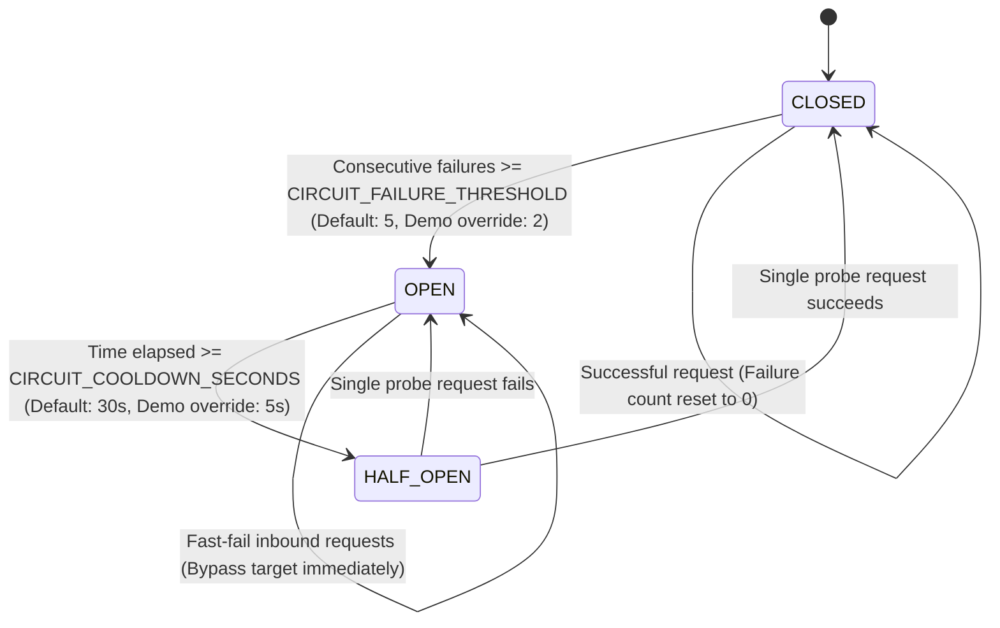

- **CLOSED**: Normal operation. Requests pass through to the provider. Failure counter increments on logical provider failure and resets to 0 on success.
- **OPEN**: Provider is shielded. Requests bypass this provider immediately without waiting for network timeouts.
- **HALF_OPEN**: After `CIRCUIT_COOLDOWN_SECONDS`, the gateway permits a single probe request via an atomic Redis lock (`circuit:{provider_id}:lock`). If the probe succeeds, the circuit transitions to **CLOSED**; if it fails, it trips back to **OPEN**.
- **Redis Degradation Fallback**: If Redis becomes unreachable, `CircuitBreakerManager` automatically falls back to an in-memory storage implementation (`InMemoryCircuitStorage`), ensuring continuous operation for the local process while logging a warning.

---

## 6. State Management & Data Model

The gateway maintains an explicit separation between **ephemeral operational state** (Redis) and **durable relational state** (PostgreSQL):

```text
┌────────────────────────────────────────────────────────┐
│               Redis (Operational State)                │
├────────────────────────────────────────────────────────┤
│ • ratelimit:{tenant_id}       (Sliding-window sorted set)│
│ • circuit:{provider_id}:state (Current circuit state)  │
│ • circuit:{provider_id}:fails (Consecutive failure counter)
│ • circuit:{provider_id}:lock  (HALF_OPEN atomic probe lock)
│ • health:{provider_id}:*      (Latency samples & success stats)
└────────────────────────────────────────────────────────┘

┌────────────────────────────────────────────────────────┐
│             PostgreSQL (Durable Storage)               │
├────────────────────────────────────────────────────────┤
│ • tenants                     (ID, Name, Status, Timestamps)
│ • api_keys                    (TenantID, Prefix, SHA-256 Hash, Status)
│ • requests                    (RequestID, Model, Latency, Status)
│ • usage_records               (Tokens, Calculated Cost USD, Provider)
│ • provider_events             (State transitions, Error audits)
└────────────────────────────────────────────────────────┘
```

---

## 7. API Reference

All client requests must be directed to the Nginx entrypoint on port `8000`.

### `GET /health`
Basic liveness probe verifying that the gateway FastAPI application is running.

- **Authentication**: None
- **Response**: `HTTP 200 OK`
```json
{
  "status": "healthy",
  "version": "0.1.0",
  "environment": "<configured ENVIRONMENT>"
}
```
*The `environment` value reflects the configured `ENVIRONMENT` setting.*

---

### `GET /ready`
Readiness probe verifying operational storage connectivity (Redis).

- **Authentication**: None
- **Response**: `HTTP 200 OK` (when Redis is connected)
```json
{
  "status": "ready",
  "ready": true,
  "details": {
    "api": "ready",
    "redis": "connected",
    "mode": "distributed"
  }
}
```
*(If Redis is unreachable, the gateway returns `"status": "degraded"`, `"ready": true`, and `"mode": "degraded_in_memory"`).*

---

### `GET /health/providers`
Observational snapshot of all configured providers, current circuit states, and provider performance counters/latency statistics.

- **Authentication**: None
- **Response**: `HTTP 200 OK`
```json
{
  "ollama_primary": {
    "provider_id": "ollama_primary",
    "total_requests": 14,
    "total_successes": 14,
    "total_failures": 0,
    "success_rate": 1.0,
    "last_latency_ms": 782.4,
    "latency_p50_ms": 782.4,
    "latency_p95_ms": 782.4,
    "latency_p99_ms": 782.4,
    "last_success_at": 1790875438.2,
    "last_failure_at": null,
    "last_error_category": null,
    "circuit_state": "CLOSED"
  },
  "ollama_secondary": {
    "provider_id": "ollama_secondary",
    "total_requests": 0,
    "total_successes": 0,
    "total_failures": 0,
    "success_rate": 0.0,
    "last_latency_ms": null,
    "latency_p50_ms": null,
    "latency_p95_ms": null,
    "latency_p99_ms": null,
    "last_success_at": null,
    "last_failure_at": null,
    "last_error_category": null,
    "circuit_state": "CLOSED"
  }
}
```

---

### `POST /v1/chat/completions`
OpenAI-compatible chat completion endpoint executing the complete resilience pipeline.

- **Authentication**: `Authorization: Bearer <API_KEY>`
- **Headers**: `Content-Type: application/json`, `X-Request-ID: <optional-uuid>`
- **Request Body**:
```json
{
  "model": "qwen2.5:3b",
  "messages": [
    {"role": "user", "content": "Explain circuit breakers in distributed systems in one sentence."}
  ],
  "temperature": 0.7,
  "max_tokens": 50,
  "metadata": {"feature": "chat"}
}
```
- **Response**: `HTTP 200 OK`
```json
{
  "id": "chatcmpl-3316e5f1-d0ce-490d-98eb-70d9636d96fe",
  "object": "chat.completion",
  "created": 1790875438,
  "model": "qwen2.5:3b",
  "choices": [
    {
      "index": 0,
      "message": {
        "role": "assistant",
        "content": "Circuit breakers prevent cascading system failure by temporarily halting requests to failing upstream services."
      },
      "finish_reason": "stop"
    }
  ],
  "usage": {
    "prompt_tokens": 28,
    "completion_tokens": 17,
    "total_tokens": 45
  }
}
```

---

### `POST /admin/chaos`
Deterministic failure injection endpoint for testing failover and circuit trips (Available only when `ENVIRONMENT != production` and `CHAOS_ENABLED=true`).

- **Authentication**: `Authorization: Bearer <ADMIN_API_KEY>`
- **Request Body**:
```json
{
  "provider_id": "ollama_primary",
  "fault": "SERVER_ERROR",
  "failure_count": 3,
  "duration_seconds": null,
  "latency_seconds": 0.0
}
```
- **Response**: `HTTP 200 OK`
```json
{
  "provider_id": "ollama_primary",
  "fault": "SERVER_ERROR",
  "duration_seconds": null,
  "failure_count": 3,
  "latency_seconds": 0.0,
  "injected_count": 0
}
```

---

## 8. Configuration Reference

All settings are configured via environment variables and loaded into `app.core.config.Settings`:

| Environment Variable | Default Value | Description |
| :--- | :--- | :--- |
| `ENVIRONMENT` | `development` | Runtime environment mode (`development`, `production`, `test`) |
| `LOG_LEVEL` | `INFO` | Structured JSON log verbosity (`DEBUG`, `INFO`, `WARNING`, `ERROR`) |
| `APP_HOST` | `0.0.0.0` | Binding host address |
| `APP_PORT` | `8000` | Internal gateway application port |
| `REDIS_URL` | `redis://localhost:6379/0` | Redis connection URL for operational state |
| `DATABASE_URL` | `postgresql+asyncpg://...` | PostgreSQL async connection URL |
| `DB_POOL_SIZE` | `10` | Database connection pool size |
| `DB_MAX_OVERFLOW` | `20` | Maximum connection overflow for database pool |
| `DB_POOL_TIMEOUT` | `30.0` | Connection pool acquisition timeout (seconds) |
| `LLM_PROVIDER` | `ollama` | Default LLM provider backend type |
| `OLLAMA_BASE_URL` | `http://localhost:11434` | Base URL for Ollama inference instance |
| `OLLAMA_MODEL` | `qwen2.5:3b` | Default model pulled and served |
| `PROVIDER_TIMEOUT` | `30.0` | Timeout in seconds per individual upstream provider attempt |
| `MAX_RETRIES` | `2` | Number of retry attempts on the same provider before failover |
| `RETRY_BASE_DELAY` | `0.5` | Initial backoff delay in seconds |
| `RETRY_MAX_DELAY` | `5.0` | Maximum capped backoff delay in seconds |
| `RETRY_JITTER` | `true` | Enable uniform random jitter scaling ($[0.5, 1.5]$) |
| `CIRCUIT_FAILURE_THRESHOLD` | `5` | Consecutive provider failures before circuit trips to `OPEN` (Overridden to `2` in demo) |
| `CIRCUIT_COOLDOWN_SECONDS` | `30.0` | Cooldown duration before transitioning `OPEN` $\to$ `HALF_OPEN` (Overridden to `5.0` in demo) |
| `CIRCUIT_HALF_OPEN_MAX_PROBES` | `1` | Number of concurrent probe requests permitted during `HALF_OPEN` |
| `MAX_FAILOVER_PROVIDERS` | `3` | Maximum candidate providers attempted per request |
| `DEFAULT_TENANT_RPM` | `60` | Default sliding-window rate limit quota per tenant |
| `RATE_LIMIT_WINDOW_SECONDS` | `60` | Duration of the sliding-window rate limit interval (seconds) |
| `API_KEY_CACHE_TTL_SECONDS` | `180` | In-memory cache TTL for authenticated API keys |
| `OTEL_ENABLED` | `true` | Enable OpenTelemetry tracing instrumentation |
| `OTEL_SERVICE_NAME` | `self-healing-llm-gateway` | OpenTelemetry service name attribute |
| `CHAOS_ENABLED` | `false` | Enable `/admin/chaos` failure injection (Disabled in production) |
| `ADMIN_API_KEY` | *(empty)* | Secret key required for `/admin/*` management routes |
| `GRAFANA_PORT` | `3002` | Host port mapped to Grafana dashboards |

---

## 9. Prerequisites

Before running the gateway, ensure your system has:
- **Operating System**: Windows (PowerShell), macOS, or Linux.
- **Docker Desktop**: Docker Engine 24.0+ with Docker Compose v2.
- **Git**: Installed and available on system PATH.
- **Python**: Python 3.12+ (required only if running host-side unit tests or scripts).
- **uv**: Fast Python package manager (`pip install uv` or standalone installer).
- **Hardware/Disk**: At least 4 GB free disk space is recommended for the model and local Docker artifacts; additional space may be required depending on Docker image and volume usage.

---

## 10. Quick Start (Standard 7-Service Stack)

Follow these step-by-step instructions in **Windows PowerShell** to run the complete local environment.

### 1. Clone the Repository
```powershell
git clone https://github.com/devgouravmax123/self-healing-llm-gateway.git
cd self-healing-llm-gateway
```

### 2. Configure Environment File
```powershell
if (-not (Test-Path .env)) {
    Copy-Item .env.example .env
}
```
*If `.env` already exists, review it instead of overwriting it.*

### 3. Start the Complete Docker Stack
```powershell
docker compose up -d
```

### 4. Verify Running Services
```powershell
docker compose ps
```
*Verify that all 7 services (`llm-gateway-api`, `llm-gateway-postgres`, `llm-gateway-redis`, `llm-gateway-ollama`, `llm-gateway-nginx`, `llm-gateway-prometheus`, `llm-gateway-grafana`) are running and that services with configured healthchecks report healthy.*

### 5. Download the Configured Model into Ollama
```powershell
docker compose exec ollama ollama pull qwen2.5:3b
```
Verify the model is ready:
```powershell
docker compose exec ollama ollama list
```

### 6. Verify Health & Readiness Probes
```powershell
# Liveness Probe
Invoke-RestMethod -Uri "http://localhost:8000/health" -Method GET

# Readiness Probe
Invoke-RestMethod -Uri "http://localhost:8000/ready" -Method GET
```

Expected response for `/ready`:
```json
{
  "status": "ready",
  "ready": true,
  "details": {
    "api": "ready",
    "redis": "connected",
    "mode": "distributed"
  }
}
```

### 7. Bootstrap a Local Demo API Key
All `/v1/` endpoints require a SHA-256 hashed API key stored in PostgreSQL. Generate a fresh local key:
```powershell
docker compose exec gateway python scripts/bootstrap_local_demo.py
```

This outputs your generated plaintext API key:
```text
============================================================
Self-Healing LLM Gateway — Local Demo API Key Generated
============================================================
Tenant ID : demo_tenant
API Key   : gw_live_...
------------------------------------------------------------
Keep this key private. It is stored hashed and printed once.
============================================================
```

### 8. Send Your First Authenticated Request
Store your key in a PowerShell variable and execute the request:

```powershell
$apiKey = "<PASTE_YOUR_GENERATED_API_KEY>"

$headers = @{
    Authorization = "Bearer $apiKey"
    "Content-Type" = "application/json"
}

$body = @{
    model = "qwen2.5:3b"
    messages = @(
        @{
            role = "user"
            content = "Explain quantum computing in one sentence."
        }
    )
    temperature = 0.7
} | ConvertTo-Json -Depth 5

Invoke-RestMethod `
    -Uri "http://localhost:8000/v1/chat/completions" `
    -Method POST `
    -Headers $headers `
    -Body $body
```

---

## 11. 🎬 Provider Failover & Self-Healing Demonstration

This demonstration verifies container and TCP connection-level fault isolation and failover using two independent Ollama inference containers (`llm-gateway-ollama-primary` and `llm-gateway-ollama-secondary`) running on the local Docker network.

```text
Healthy State (Primary Active)
              │
              ▼
Process Termination (docker stop llm-gateway-ollama-primary)
              │
              ▼
Gateway Detects Socket Drop -> Bounded Retries on Primary (attempts 1..3)
              │
              ▼
Repeated logical provider failures reach configured threshold -> Primary Circuit Trips OPEN
              │
              ▼
Automatic Cross-Target Failover -> Request Served by Secondary (ollama-secondary)
              │
              ▼
Primary Container Restarted (docker start llm-gateway-ollama-primary)
              │
              ▼
Cooldown Elapses (5s) -> HALF_OPEN Probe Request
              │
              ▼
Primary Circuit Returns to CLOSED -> Normal Priority Restored
```

> [!NOTE]
> **Scope & Topology Notice**: Both providers run as independent Docker containers on the same Docker host workstation with dedicated storage volumes (`ollama_primary_data` and `ollama_secondary_data`). This demonstration verifies process-, container-, and TCP connection-level fault isolation, not multi-datacenter geographic redundancy or separate physical servers.

### Step-by-Step Manual Demonstration (PowerShell)

#### Step 1 — Start the Multi-Container Failover Stack
```powershell
docker compose -f docker-compose.yml -f docker-compose.demo.yml up -d
```

#### Step 2 — Pull the Model into BOTH Independent Providers
```powershell
docker exec llm-gateway-ollama-primary ollama pull qwen2.5:3b
docker exec llm-gateway-ollama-secondary ollama pull qwen2.5:3b
```
Verify model readiness in both containers:
```powershell
docker exec llm-gateway-ollama-primary ollama list
docker exec llm-gateway-ollama-secondary ollama list
```

#### Step 3 — Bootstrap API Key (if not already done)
```powershell
docker compose exec gateway python scripts/bootstrap_local_demo.py
```

#### Step 4 — Send Baseline Normal Request (Healthy Primary)
```powershell
$apiKey = "<PASTE_YOUR_API_KEY>"

$headers = @{
    Authorization = "Bearer $apiKey"
    "Content-Type" = "application/json"
}

$body = @{
    model = "qwen2.5:3b"
    messages = @(
        @{
            role = "user"
            content = "Ping"
        }
    )
} | ConvertTo-Json -Depth 5

Invoke-RestMethod -Uri "http://localhost:8000/v1/chat/completions" -Method POST -Headers $headers -Body $body
```
- **Observed State**: Request executes against `ollama_primary` (priority 1). Returns `HTTP 200 OK`.
- **Circuit Breaker**: `ollama_primary` = CLOSED, `ollama_secondary` = CLOSED.

#### Step 5 — Terminate the Primary Provider Container
```powershell
docker stop llm-gateway-ollama-primary
```
Verify `llm-gateway-ollama-primary` is completely offline while the gateway and `llm-gateway-ollama-secondary` remain healthy:
```powershell
docker compose -f docker-compose.yml -f docker-compose.demo.yml ps
```

#### Step 6 — Send Client Request During Primary Outage
Send the exact same request without changing any client parameters:
```powershell
Invoke-RestMethod -Uri "http://localhost:8000/v1/chat/completions" -Method POST -Headers $headers -Body $body
```
- **Observed Outcome**: Client receives seamless `HTTP 200 OK` with valid completion text.
- **Behind the Scenes**:
  1. Primary socket fails (`CONNECTION_ERROR`).
  2. Gateway executes bounded retries on primary.
  3. The failed provider attempt is recorded against the primary circuit.
  4. If repeated logical provider failures reach the configured threshold, `ollama_primary` transitions to **OPEN**.
  5. The gateway selects `ollama_secondary` (priority 2) as the next eligible target and completes the request there.

#### Step 7 — Observe Circuit & Metrics in Grafana
Open Grafana at **[http://localhost:3002](http://localhost:3002)** (`admin` / `admin`):
- **Provider Circuit State**: Displays `ollama_primary [open]` (Active) and `ollama_secondary [closed]` (Active).
- **Failovers Metric**: `gateway_failovers_total{from_provider="ollama_primary", to_provider="ollama_secondary"}` increments.
- **Token Delivery**: Tokens continue delivering via `ollama_secondary`.

#### Step 8 — Restart Primary Provider Container
```powershell
docker start llm-gateway-ollama-primary
```
Wait 5–10 seconds for the container health check to report healthy.

#### Step 9 — Self-Healing Recovery Probe
After `CIRCUIT_COOLDOWN_SECONDS` (5.0s in demo override), send another completion request:
```powershell
Invoke-RestMethod -Uri "http://localhost:8000/v1/chat/completions" -Method POST -Headers $headers -Body $body
```
- **Recovery Lifecycle**: `ollama_primary` enters `HALF_OPEN` state, allowing 1 probe request through.
- **Probe Success**: The probe completes successfully against restored `ollama_primary`, resetting failure counters and returning the circuit state to **CLOSED**.

#### Step 10 — Verify Restored Steady State
- **Grafana Panel**: Both `ollama_primary [closed]` and `ollama_secondary [closed]` return to steady state.
- **Provider Snapshot**: Query `http://localhost:8000/health/providers` to verify both circuits are CLOSED.

---

### Automated Demonstration Script
You can also run the entire sequence automatically with live step assertions:
```powershell
python scripts/demo_physical_failover.py --api-key <PASTE_YOUR_API_KEY>
```

---

## 12. Reliability Demo Evidence

The following screenshots provide verified operational evidence from the multi-container provider failover and self-healing demonstration.

### Phase A — Baseline Normal State

#### 01 — Baseline Request via Healthy Primary Provider
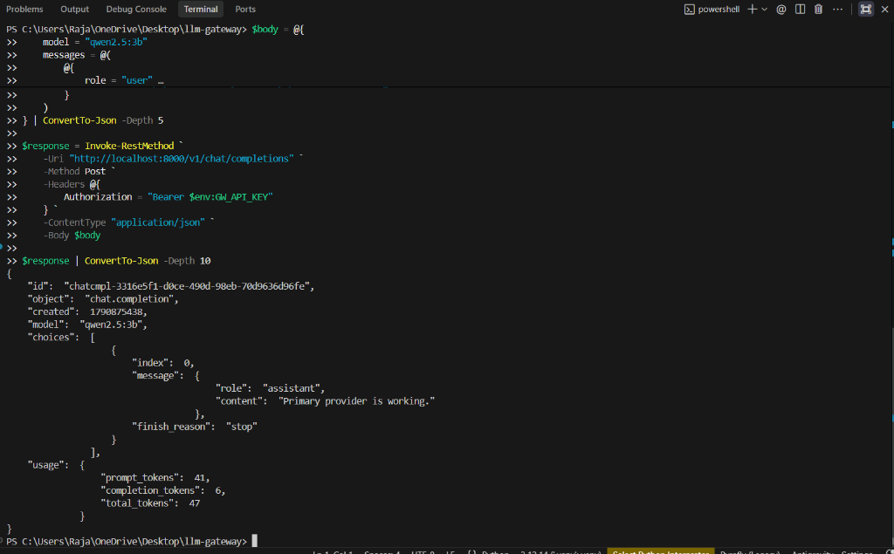
*PowerShell console showing authenticated completion request sent to `http://localhost:8000/v1/chat/completions` returning `HTTP 200 OK` from `qwen2.5:3b` via the healthy primary provider.*

#### 02 — Healthy Baseline Telemetry in Grafana (Traffic & Latency)
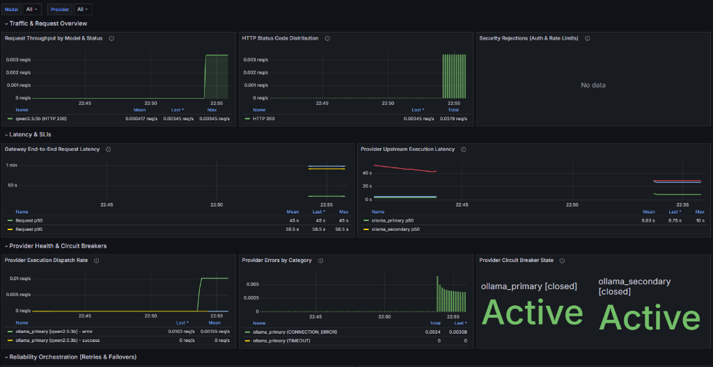
*Grafana overview displaying normal `HTTP 200` request throughput and upstream provider latency while both `ollama_primary` and `ollama_secondary` circuit breakers are in the `[closed]` Active state.*

#### 03 — Healthy Baseline Telemetry in Grafana (Reliability & Token Counts)
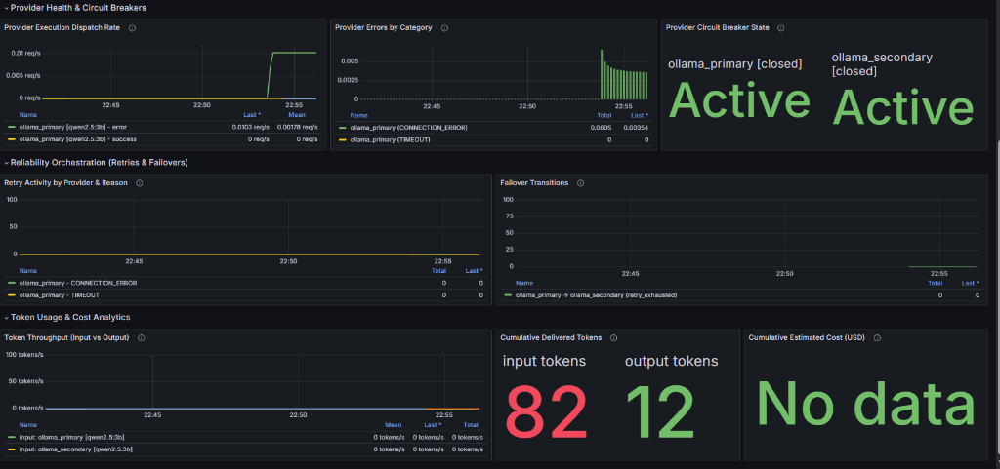
*Grafana reliability panels showing 0 retries, 0 failover events, and initial cumulative tokens delivered (82 input / 12 output) during baseline operation.*

---

### Phase B — Primary Provider Outage & Automatic Failover

#### 14 — Primary Provider Container Termination via Docker CLI
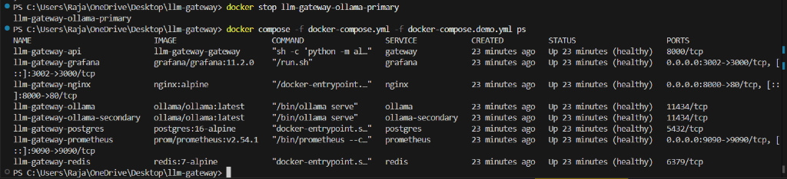
*Execution of `docker stop llm-gateway-ollama-primary` followed by `docker compose ps`, verifying that `llm-gateway-ollama-primary` was taken offline while the gateway, secondary provider, and all storage services remained running.*

#### 06 — Transparent Client Response During Primary Outage
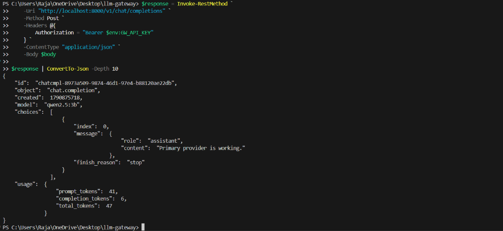
*PowerShell console showing the exact same client request returning `HTTP 200 OK` seamlessly during the primary provider outage without client modification.*

#### 04 — Primary Circuit Tripped to OPEN & Secondary In-Use (Traffic & Circuits)
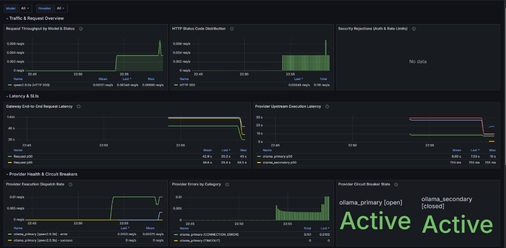
*Grafana panel displaying `ollama_primary [open]` following connection errors, while `ollama_secondary [closed]` actively takes over upstream traffic.*

#### 05 — Failover Transitions & Secondary Token Delivery in Grafana
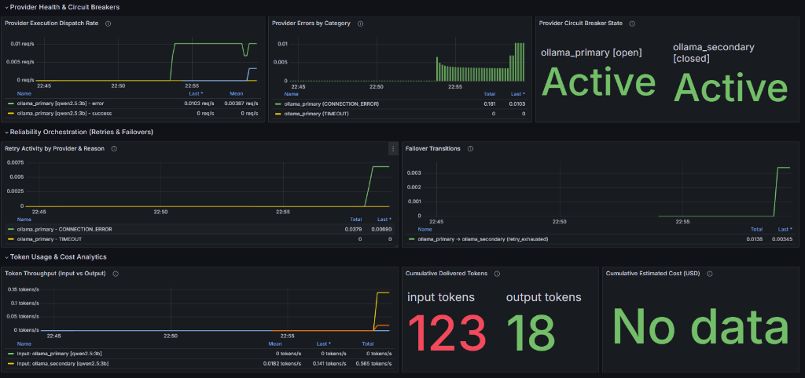
*Grafana reliability panels registering retry activity, the failover transition metric (`ollama_primary → ollama_secondary (retry_exhausted)`), and token delivery continuing through the secondary provider (123 input / 18 output).*

---

### Phase C — Container Restoration & Circuit Recovery

#### 07 — Restoring Primary Provider Container via Docker CLI
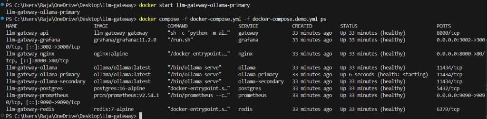
*Execution of `docker start llm-gateway-ollama-primary` progressing from `health: starting` to healthy alongside the running secondary container.*

#### 08 — Recovery Request Execution (HALF_OPEN Probe)
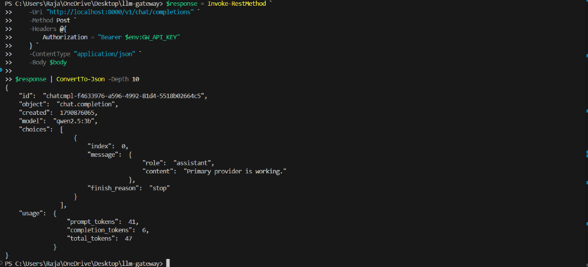
*Client request sent after cooldown executes successfully (`HTTP 200 OK`), initiating probe recovery on the restored primary provider.*

#### 09 — Restored System & Closed Circuit Breakers in Grafana
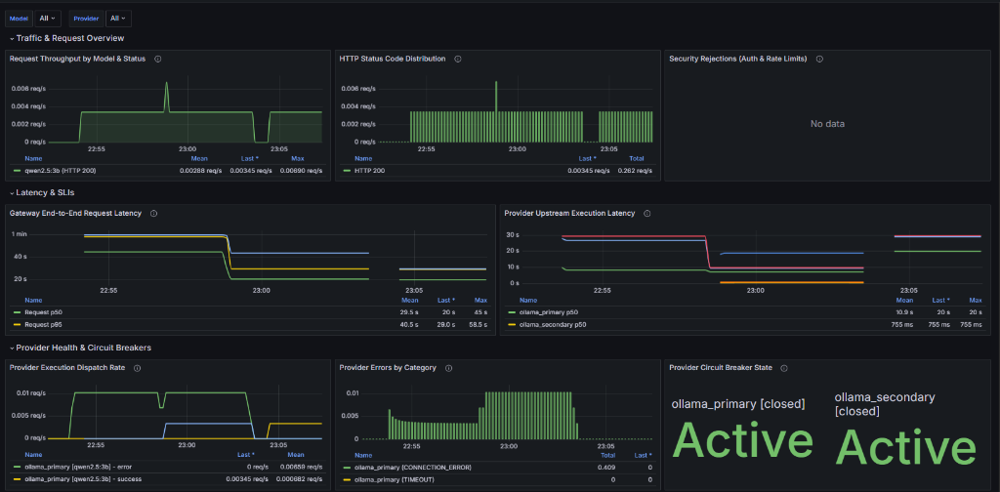
*Grafana traffic and circuit breaker state panel showing both `ollama_primary [closed]` and `ollama_secondary [closed]` back in the Active state following successful probe recovery.*

#### 10 — Post-Recovery Metrics & Token Accounting in Grafana
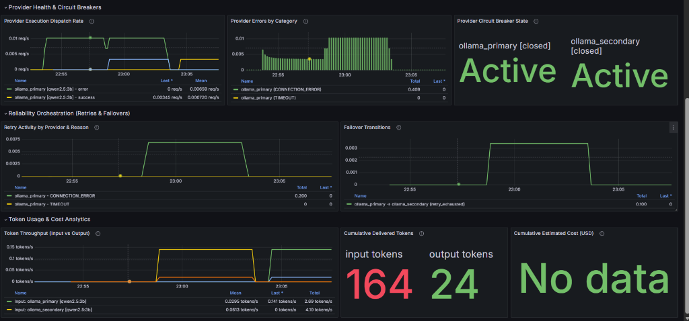
*Grafana reliability panels showing failover rate returning to 0, primary provider traffic resuming, and cumulative tokens reaching 164 input / 24 output.*

#### 11 — Verified Primary Execution Following Full Recovery
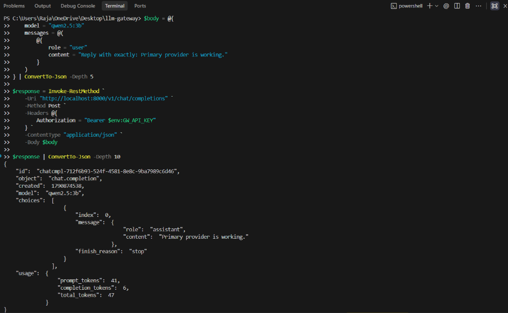
*Subsequent completion request confirming steady-state priority-1 routing to the primary provider with model response `"Primary provider is working."`.*

---

### Phase D — Steady-State Operational Telemetry

#### 12 — Steady-State Operational Telemetry in Grafana (Top Panels)
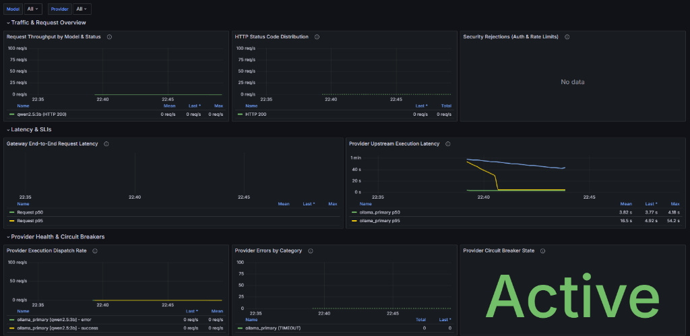
*Grafana top view displaying steady-state traffic metrics, normalized upstream execution latency across models, and active CLOSED circuit breaker status.*

#### 13 — Steady-State Reliability & Token Accounting in Grafana (Bottom Panels)
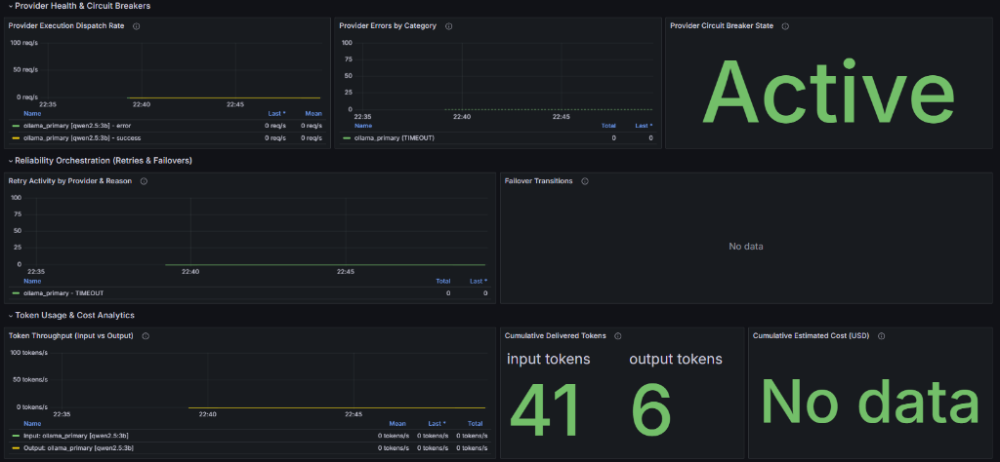
*Grafana lower view showing 0 error dispatch rates, 0 active failovers during steady-state operation, and consistent cumulative token metrics.*

---

## 13. Observability & Monitoring

The gateway exports rich telemetry covering request lifecycles, provider health, and operational metrics.

### Prometheus Metrics Engine
Prometheus scrapes internal gateway metrics from `http://gateway:8000/metrics` every 10 seconds. Verified metric families in `app/observability/metrics.py`:
- `gateway_requests_total{model, status_code}`: Total incoming HTTP chat-completion requests.
- `gateway_request_duration_seconds{model, status_code}`: End-to-end gateway request latency histogram.
- `gateway_provider_requests_total{provider, model, status}`: Dispatched physical provider execution attempts.
- `gateway_provider_duration_seconds{provider, model}`: Upstream provider attempt duration histogram.
- `gateway_provider_errors_total{provider, model, error_category}`: Failed provider attempts by error category.
- `gateway_retries_total{provider, reason}`: Executed retry attempts.
- `gateway_failovers_total{from_provider, to_provider, reason}`: Cross-target failover transitions.
- `gateway_circuit_state{provider, state}`: One-hot circuit state gauge (`closed`, `open`, `half_open`).
- `gateway_auth_failures_total{reason}`: Authentication rejections by reason.
- `gateway_rate_limit_rejections_total{reason}`: Rate limit rejections per tenant.
- `gateway_tokens_total{provider, model, type}`: Delivered input/output token counts.
- `gateway_estimated_cost_usd_total{provider, model}`: Attributed cost tracking in USD.

### Grafana Dashboards
- **URL**: [http://localhost:3002](http://localhost:3002)
- **Default Credentials**: `admin` / `admin`
- **Provisioned Dashboard**: *Self-Healing LLM Gateway — Operational Overview* visualizing throughput, error distribution, p50/p95/p99 latencies, circuit states, and token delivery.

---

## 14. Automated Testing & Quality Assurance

The codebase includes an extensive test suite covering units, components, API contracts, and integration scenarios.

### Test Suite Execution Summary

```powershell
uv sync --extra dev
uv run pytest -q
```

**Verified Test Result**:
```text
315 collected: 297 passed, 18 skipped, 1 warning in 115.27s
```

### Explanation of the 18 Skipped Integration Tests
When executing `pytest` directly on the host workstation:
- **7 tests** in `tests/test_database_integration.py` & **3 tests** in `tests/test_usage_integration.py` check for host-accessible PostgreSQL at `localhost:5432`.
- **6 tests** in `tests/test_health_integration.py`, **1 test** in `tests/test_redis_integration.py`, & **1 test** in `tests/test_rate_limit_concurrency.py` check for host-accessible Redis at `localhost:6379`.

**Architectural Context**: PostgreSQL (`5432`) and Redis (`6379`) are fully operational inside the Docker Compose `llm-gateway-network` bridge network, but their ports are intentionally not exposed to the host operating system for security isolation. When integration tests run on the host outside the Docker bridge network, they detect that the local ports are unreachable and cleanly skip. **Zero tests failed.**

To inspect skip reasons:
```powershell
uv run pytest -rs
```

### Code Formatting & Static Analysis
```powershell
# Format and linting
uv run ruff check .
uv run ruff format --check .

# Static type checking
uv run mypy app tests
```

---

## 15. Measured Performance & Load-Testing Benchmarks

Load testing was conducted across synthetic scenarios using k6 (documented in detail in [`docs/LOAD_TESTING.md`](docs/LOAD_TESTING.md)).

| Benchmark Scenario | Description | Virtual Users (VUs) | Requests Processed | Success Rate | Measured p95 Latency | Key Observed Outcome |
| :--- | :--- | :---: | :---: | :---: | :---: | :--- |
| **Phase 17.2: Concurrency** | Multi-VU concurrent healthy provider load | 10 VUs | 502 | **100%** (502/502) | 1.07 s | Zero errors under sustained 10 req/s provider throughput |
| **Phase 17.3: Chaos Failures** | Bounded `SERVER_ERROR` fault injection (20 faults) | 10 VUs | 751 | **99.47%** (747/751) | 1.13 s | Retries and circuit recovery resolved 5 concurrent requests |
| **Phase 17.4: Rate Limiter** | Standard 60 RPM limit saturation | 10 VUs | 4,316 | **100%** (Strict 429s) | 152.72 ms | Exactly 60 admitted requests (`200 OK`), 4,256 fast-rejected (`429`) |

*Note: Benchmarks reflect measured local containerized performance with local Ollama inference and serve as comparative validation.*

---

## 16. Security & Production Hardening

- **Cryptographic Key Storage**: API keys are hashed with SHA-256 before insertion into PostgreSQL; raw API keys are never stored or logged in plain text.
- **Tenant Isolation**: Rate limits, usage metrics, and audit logs are strictly partitioned by tenant ID.
- **Log Sanitization**: Log formatters automatically redact Bearer tokens, API keys, and sensitive authorization headers from application output.
- **Network Isolation**: PostgreSQL, Redis, and internal Ollama instances are bound exclusively to the private Docker bridge network and not exposed to the public internet.
- **Shielded Metrics Ingress**: The public Nginx reverse proxy actively blocks external requests to `/metrics` (returns HTTP 404); Prometheus scrapes the internal gateway container directly over the Docker network.
- **Admin Endpoint Safety**: The `/admin/chaos` endpoint is disabled by default (`CHAOS_ENABLED=false`) and automatically disabled in production environments (`ENVIRONMENT=production`).

---

## 17. Project Structure

```text
self-healing-llm-gateway/
├── app/                              # Core application source code
│   ├── api/                          # FastAPI route handlers
│   │   ├── routes_admin.py           # Admin & chaos injection routes (/admin/chaos)
│   │   ├── routes_chat.py            # OpenAI-compatible chat route (/v1/chat/completions)
│   │   ├── routes_health.py          # Liveness & readiness probes (/health, /ready, /health/providers)
│   │   └── routes_metrics.py         # Prometheus metrics endpoint (/metrics)
│   ├── core/                         # Configuration, auth, logging, and exceptions
│   │   ├── auth.py                   # SHA-256 API key hashing and validation
│   │   ├── config.py                 # Pydantic Settings management
│   │   └── exceptions.py             # Structured GatewayError hierarchy
│   ├── db/                           # PostgreSQL database layer & SQLAlchemy models
│   │   ├── models/                   # Tenant, ApiKey, RequestRecord, UsageRecord, ProviderEvent
│   │   └── session.py                # Async database engine and session management
│   ├── observability/                # Telemetry, OpenTelemetry, and Prometheus metrics
│   ├── pricing/                      # Model token pricing calculations
│   ├── providers/                    # LiteLLM client adapter
│   ├── reliability/                  # Core reliability engine
│   │   ├── circuit_breaker.py        # Distributed 3-state circuit breaker manager
│   │   ├── error_classifier.py       # Normalized error categorization
│   │   ├── failover.py               # Cross-target failover orchestrator
│   │   ├── rate_limiter.py           # Redis sliding-window log rate limiter
│   │   └── retry.py                  # Exponential backoff with uniform jitter
│   ├── routing/                      # Provider candidate selection and priority routing
│   ├── storage/                      # Redis connection pool and circuit state storage
│   ├── usage/                        # Asynchronous token usage and cost accounting
│   └── main.py                       # FastAPI application factory and lifecycle
├── docker/                           # Docker deployment assets
│   └── nginx/                        # Nginx reverse proxy configuration (nginx.conf)
├── docs/                             # Architecture and design documentation
│   ├── images/demo/                  # Demo evidence screenshots (01..14)
│   ├── ARCHITECTURE.md               # Detailed system topology and data flows
│   ├── DESIGN.md                     # Circuit breaker, retry math, and failover design
│   ├── LOAD_TESTING.md               # Empirical k6 load testing results
│   ├── PHYSICAL_FAILOVER_DEMO.md     # Multi-container provider failover documentation
│   └── SECURITY.md                   # Threat modeling and tenant isolation specs
├── monitoring/                       # Prometheus and Grafana provisioning
│   ├── grafana/                      # Provisioned dashboards and datasources
│   └── prometheus/                   # Prometheus scraping configuration (prometheus.yml)
├── scripts/                          # Operational and demonstration scripts
│   ├── bootstrap_local_demo.py       # Local tenant and API key generator
│   ├── demo_physical_failover.py     # Automated multi-container provider failover demo
│   └── demo_e2e_reliability.py       # Automated chaos and reliability verification
├── tests/                            # Comprehensive automated test suite (315 collected items)
├── docker-compose.yml                # Standard 7-service container stack
├── docker-compose.demo.yml           # Provider failover multi-container overlay
├── docker-compose.chaos-demo.yml     # Development chaos testing overlay
├── pyproject.toml                    # Python package dependencies and tooling config
└── README.md                         # Project documentation and reproduction guide
```

---

## 18. Limitations & Scope

- **Single Host Deployment**: The physical failover demonstration runs two isolated Ollama container processes on the same host Docker daemon, demonstrating process, container, and TCP connection-level fault isolation rather than multi-datacenter geographic redundancy.
- **Hardware Resources**: Running two simultaneous local Ollama instances with `qwen2.5:3b` requires sufficient host RAM/VRAM.
- **Local Benchmark Scope**: Performance metrics reflect local containerized execution with Ollama and serve as comparative baselines rather than theoretical cloud-scale capacity limits.

---

## 19. Documentation Index

| Document | File Path | Focus Area |
| :--- | :--- | :--- |
| **System Architecture** | [`docs/ARCHITECTURE.md`](docs/ARCHITECTURE.md) | End-to-end component topology, data flows, and boundaries |
| **Reliability Design** | [`docs/DESIGN.md`](docs/DESIGN.md) | Circuit breaker state machine, backoff math, and failover rules |
| **Provider Failover Demo** | [`docs/PHYSICAL_FAILOVER_DEMO.md`](docs/PHYSICAL_FAILOVER_DEMO.md) | Multi-container provider failover guide and topology |
| **Load Testing Benchmarks** | [`docs/LOAD_TESTING.md`](docs/LOAD_TESTING.md) | Complete empirical k6 benchmark records and latency numbers |
| **Security Architecture** | [`docs/SECURITY.md`](docs/SECURITY.md) | Threat modeling, credential hashing, and tenant isolation |
| **Deployment Guide** | [`docs/DEPLOYMENT.md`](docs/DEPLOYMENT.md) | Docker Compose operations, volume persistence, and scaling |
| **Product Requirements** | [`docs/PRD.md`](docs/PRD.md) | Core requirements and capabilities specification |
| **Architecture Decisions** | [`docs/DECISIONS.md`](docs/DECISIONS.md) | Chronological record of architectural decisions (ADRs 1–20) |

---

## 20. License

This project is licensed under the MIT License. See `LICENSE` for details.
